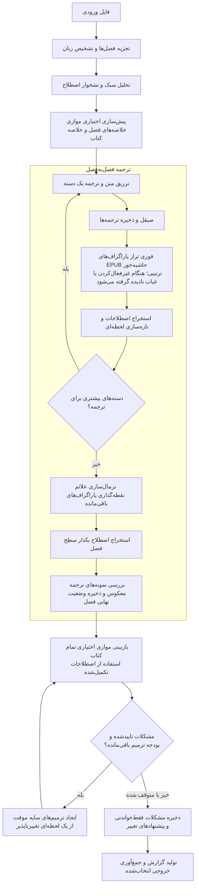

<div align="center">

# 📚 Wenyi Ketab

**یک دستور، از EPUB به ترجمه‌ای خوانا به چندین زبان.**

تحلیل تمام کتاب · اصطلاح‌های بلادرنگ · بازبینی چند‌مرحله‌ای

[](https://www.python.org/)
[](https://github.com/BigDawnGhost/wenyi/actions/workflows/tests.yml)
[](LICENSE)
[](https://github.com/BigDawnGhost/wenyi/stargazers)
[](https://discord.gg/sM3AQcF5D2)

[English](../en/README.md) | [简体中文](../zh/README.md) | **فارسی**


</div>

---

## فهرست مطالب

- [چرا Wenyi Ketab](#چرا-wenyi-ketab)
- [ویژگی‌های اصلی](#ویژگی‌های-اصلی)
- [شروع سریع](#شروع-سریع)
- [فرمت‌های پشتیبانی‌شده](#فرمت‌های-پشتیبانی‌شده)
- [خط‌لوله ترجمه](#خط‌لوله-ترجمه)
- [مستندات](#مستندات)
- [محدودیت‌ها](#محدودیت‌ها)
- [جامعه](#جامعه)
- [مجوز](#مجوز)

---

## چرا Wenyi Ketab

| رویکرد معمول | Wenyi Ketab |
|---|---|
| ترجمه بخش‌های جداگانه، بدون آگاهی از متن اطراف | پیش‌سازی تمام کتاب + خلاصه‌های فصل + متن غلطی میانی |
| اصطلاحات به‌صورت دستی یا پس‌ترتیب | استخراج اصطلاح‌های بلادرنگ، تشخیص تضادهای ترجمه و تأثیر فوری بر دسته‌های بعدی |
| ترجمه یک‌بار، آسیب‌پذیری در برابر وقفه‌ها | نقاط کنترل در سطح دسته، ردیابی وضعیت فصل: از هر جای وقفه شروع مجدد |
| خروجی خام مدل، بدون فرایند کیفیت سیستماتیک | ترجمه → صیقل → نمونه‌برداری ترجمه معکوس در سطح فصل → بازبینی کل کتاب مبتنی بر شواهد |

Wenyi Ketab برای **متون طولانی** طراحی شده است — رمان‌ها، مقالات علوم اجتماعی، داستان‌های واقعی، و غیره.

---

## ویژگی‌های اصلی

- **درک تمام کتاب** — پیش‌سازی متن مبدا قبل از ترجمه، ایجاد خلاصه‌های فصل و خلاصه‌ای در سطح کتاب که در هر دسته تزریق می‌شود
- **اصطلاح‌های بلادرنگ** — استخراج نام‌های خاص، اصطلاحات و عبارات تکراری در حین پیشرفت ترجمه؛ تشخیص ترجمه‌های متناقض و نمایش آن‌ها برای حل
- **کیفیت چند‌مرحله‌ای** — صیقل اختیاری (مدل قوی‌تر)، نمونه‌برداری ترجمه معکوس، و بازبینی کل کتاب AI مبتنی بر شواهد
- **قابلیت ادامه** — نقاط کنترل در سطح دسته، ردیابی وضعیت فصل، و نوشتن‌های حالت اتمی؛ در هر نقطه وقفه کنید و با همان دستور از سر بگیرید
- **ارائه‌دهندگان LLM متعدد** — DeepSeek، OpenAI، OpenRouter، Google Gemini، Ollama، vLLM، و نقاط انتهایی سازگار عام OpenAI
- **حفظ بومی EPUB** — نوشتن متن ترجمه‌شده در الگوهای XHTML اصلی و سعی برای حفظ سبک‌ها، تصاویر، فهرست محتویات و لنگرها
- **خروجی دو‌زبانی** — نسخه اختیاری متن اصلی و ترجمه‌شده با متن اصلی کمرنگ‌شده بصری، از جمله پشتیبانی حالت تاریک

---

## شروع سریع

### پیش‌نیاز‌ها

Wenyi Ketab نیاز به Python 3.10+ و [uv](https://docs.astral.sh/uv/) دارد.

### نصب

```bash
git clone https://github.com/BigDawnGhost/wenyi.git
cd wenyi
uv sync
```

### تنظیم

کلید API را تنظیم کنید:

```bash
export DEEPSEEK_API_KEY=sk-...
```

### ترجمه یک‌دستوری

```bash
uv run trans-novel translate book.epub
```

این کتاب را تجزیه می‌کند، زبان مبدا را تشخیص می‌دهد، برای درک پیش‌سازی می‌کند، تمام فصل‌ها را ترجمه می‌کند و خروجی را جمع‌آوری می‌کند. EPUB تک‌زبانی فارسی در `output/book.fa.epub` نوشته می‌شود.

### گردش کار قدم‌به‌قدم

```bash
# 1. آماده‌سازی — تجزیه، تحلیل، پیش‌سازی (متن بدنه ترجمه نشده)
uv run trans-novel prepare book.epub

# 2. ترجمه — از حالت آماده‌شده از سر بگیرید
uv run trans-novel translate book.epub

# 3. بازبینی — بازبینی نهایی مستقل علیه اصطلاحات تکمیل‌شده
uv run trans-novel review book.epub

# 4. بررسی پیشرفت
uv run trans-novel status book.epub
```

### وقفه و ادامه

هر دسته تکمیل‌شده بلافاصله پایدار می‌شود. اگر یک اجرا وقفه خورد، همان دستور را دوباره اجرا کنید:

```bash
uv run trans-novel translate book.epub
```

### نوشتار خط فرمان

```bash
uv run trans-novel translate book.epub --polish --review          # فعال‌کردن صیقل و بازبینی نهایی
uv run trans-novel translate book.epub --no-polish                # غیرفعال‌کردن صیقل
uv run trans-novel translate book.epub --bilingual                # تولید نسخه دو‌زبانی
uv run trans-novel translate book.epub --chapter 0                # ترجمه فقط فصل اول (شاخص‌ها از 0 شروع می‌شوند)
uv run trans-novel translate book.epub --format txt               # خروجی به‌عنوان متن ساده
```

بازبینی نهایی به‌طور پیش‌فرض غیرفعال است. `pipeline.review: true` را تنظیم کنید تا پس از تکمیل ترجمه تمام کتاب و رسیدن اصطلاحات به حالت نهایی، خودکار اجرا شود، یا Agent Review را به‌صورت مستقل اجرا کنید:

```bash
uv run trans-novel review book.epub
```

هر اجرای بازبینی از ابتدا شروع می‌شود، بخش‌های متن را به‌صورت همزمان بررسی می‌کند و می‌تواند به‌صورت انتخابی قبل از حل تناقض‌های پیشنهاد سازگاری، شواهد مختلف کتاب‌ها را درخواست کند. مشکلات تایید‌شده می‌توانند جایگزین‌های بخش کامل موقت را در ترجمه سایه محدود اجرا ایجاد کنند. بازبینی کل کتاب تازه فقط متن سایه را می‌بیند — نه توضیح مشکل دور قبل — و دوباره تایید می‌کند. وضعیت ترجمه رسمی هرگز تغییر نمی‌کند. نتیجه‌های یکپارچه فقط خواندنی، استفاده‌ی اجرا، رویدادها و ریکوردهای دور داخلی در `state/<book>/reviews/review-<timestamp>/` نوشته می‌شوند.

---

## فرمت‌های پشتیبانی‌شده

| ورودی | خروجی |
|---|---|
| EPUB, FB2, TXT, Markdown, HTML, PDF | EPUB (تک‌زبانی / دو‌زبانی), TXT, HTML, Markdown, Word |

- ورودی PDF نیاز به `MINERU_API_KEY` برای تبدیل اولیه دارد؛ HTML حاصل ذخیره‌شده و دوباره استفاده می‌شود.
- خروجی EPUB سعی می‌کند سبک‌ها، تصاویر، فهرست محتویات و لنگرهای کتاب اصلی را حفظ کند. طرح عمودی برای خواندن فارسی به افقی تبدیل می‌شود.
- زبان مبدا به‌طور پیش‌فرض خودکار تشخیص داده می‌شود، یا می‌توان آن را به کد ISO 639-1 در `config.yaml` ثابت کرد.

---

## خط‌لوله ترجمه



هنگام فعال‌کردن، مرحله پیش‌سازی با همزمانی قابل تنظیم و idempotent اجرا می‌شود — خلاصه‌های تکمیل‌شده بین اجراها دوباره استفاده می‌شوند. در حین ترجمه، هر دسته آخرین لحظه‌ای اصطلاحات و متن میانی پیچیده‌شده را دریافت می‌کند.

Review Fixer خط‌لوله سبک، خلاصه کتاب، خلاصه فصل، زیرمجموعه‌ی اصطلاحات مربوطه و متن اطراف اصل/ترجمه را دریافت می‌کند تا سبک کتاب را حفظ کند؛ جایگزین‌های آن فقط در متن سایه اجرای فعلی وجود دارند.

---

## مستندات

- [راهنمای استفاده](../usage.md) — نصب، تنظیم Windows، ورودی/خروجی، قابلیت ادامه، مراحل مستقل
- [تنظیم](../configuration.md) — ارائه‌دهندگان، زبان‌ها، سوئیچ‌های خط‌لوله، تقسیم‌بندی، مسیرها
- [خط‌لوله ترجمه](../pipeline.md) — تحلیل تمام کتاب، اصطلاح‌ات، متن، صیقل، بازبینی
- [مشارکت](../CONTRIBUTING.md) — توسعه، آزمایش و راهنمای مشارکت

دایرکتوری‌های حالت ترجمه برای کتاب‌های دولتی ممکن است از طریق [wenyi-bookcase](https://github.com/BigDawnGhost/wenyi-bookcase) اشتراک‌گذاری شوند. لطفاً متن حق نشر، کتاب‌های خصوصی یا `state/` را منتشر نکنید.

---

## محدودیت‌ها

- خط‌لوله ترجمه برای خروجی فارسی بهینه‌شده است؛ زبان‌های هدف دیگر اکنون پشتیبانی می‌شوند.
- صیقل و بازبینی نهایی مراحل گران‌ترین هستند. ترمیم سایه ممکن است چندین پاس بازبینی کل کتاب و تماس‌های اضافی Fixer را فعال کند.
- ورودی PDF به خدمت خارجی MinerU بستگی دارد؛ تبدیل اولیه به کلید API نیاز دارد.
- کیفیت ترجمه توسط قابلیت‌های مدل LLM انتخاب‌شده محدود است.
- کتاب‌های بسیار طولانی ممکن است دایرکتوری‌های حالت بزرگ تولید کنند؛ نیازهای ذخیره‌سازی با طول کتاب رشد می‌کند.

---

## جامعه

- [سرور Discord](https://discord.gg/sM3AQcF5D2)
- گروه QQ: 1055065098
- [GitHub Issues](https://github.com/BigDawnGhost/wenyi/issues) — گزارش اشکالات و درخواست ویژگی‌ها
- [GitHub Discussions](https://github.com/BigDawnGhost/wenyi/discussions) — ایده‌ها و سؤالات

---

## مجوز

[MIT](LICENSE)
